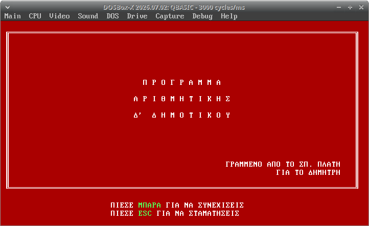
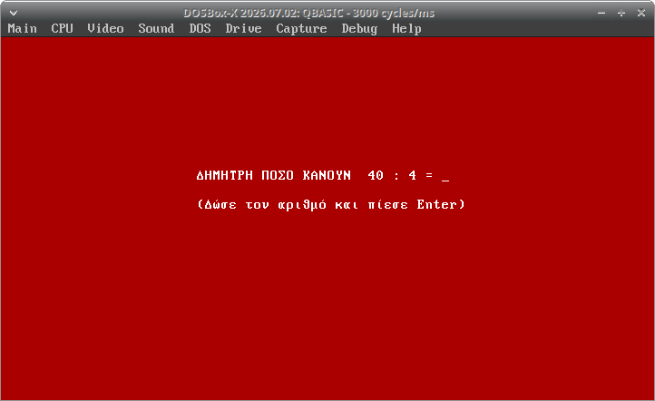
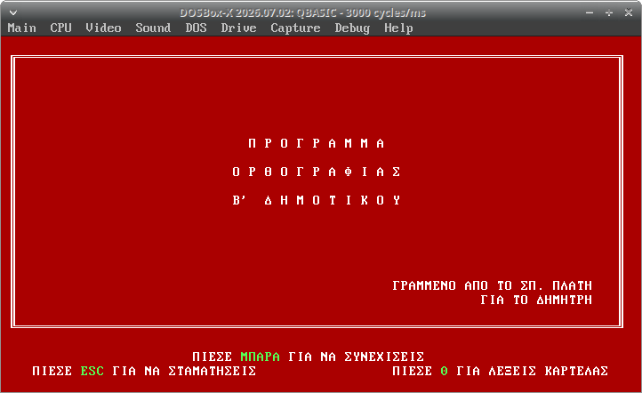

# qbasic-spelling-maths

This repository contains two QBasic programs (`DIMITRIS.BAS` and `ORTHO.BAS`)
developed by Sp. Platis for @platisd.
They were designed to train in primary school spelling and mathematics.
They were authored around 1996 and 1998 and used to run in the family's home computer,
in a DOS environment.

Their "unique" feature is the motivation they provided: For every correct answer the user was rewarded with 1 drachma. 🤑

The code is provided for historical and nostalgic purposes, have fun exploring it.

### Running the programs (Ubuntu)

I was able to run the programs using a `dosbox-x` AppImage
and pointing to a copy of `QBASIC.EXE` that I found inside `Olddos.exe`
(a collection of old DOS programs).

Here are some screenshots:

<a href="media/maths.png"></a>
<a href="media/maths-gameplay.png"></a>
<a href="media/spelling.png"></a>

Before running the programs you need to convert the source files from UTF-8
to the DOS Greek code page (CP737) using the `iconv` command line tool:

```bash
iconv -f UTF-8 -t CP737 DIMITRIS.bas > DIMITRIS.CP737.BAS
iconv -f UTF-8 -t CP737 ORTHO.bas    > ORTHO.CP737.BAS
```
